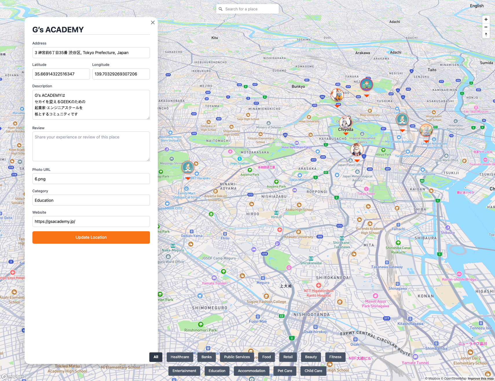

# kadai06_js

# ①課題番号-プロダクト名

3D Tokyo Map For Foreigners

## ②課題内容（どんな作品か）

- 3D Tokyo Map For Foreigners

## ③DEMO

- https://cmcz.github.io/kadai06_js/

    

## ④作ったアプリケーション用のIDまたはPasswordがある場合

- ID: 今回なし
- PW: 今回なし

## ⑤工夫した点・こだわった点

- Mapbox APIの使い方と可能性
- 欲しい機能の試作
    - 簡単検索とナビゲーション
    - 施設別でのフィルター
    - ユーザー投稿レビュー
    - 多言語対応

## ⑥難しかった点・次回トライしたいこと(又は機能)

## ⑦次回ミニ講義で聞きたいこと

- API KEYは公開したくないが、一部の人にページを使ってもらい、コメントをもらいたい場合、どのようにすればいいか聞きたいです。

## ⑧フリー項目（感想、シェアしたいこと等なんでも）

- 短時間でいろんな機能を作りたかったので、今回はCursorをしっかり使ってみました。意外と課金しなくても色々と機能が使えていますね。